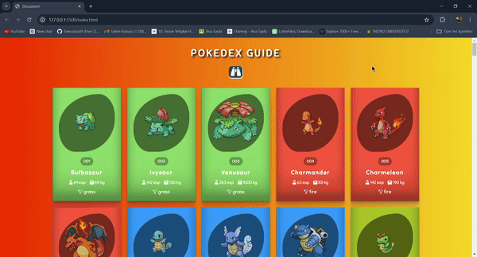

# pokedexGuide

#Features
-Pokémon Information: 

-Information about each Pokémon, such as its ID, strength, weight and element. 

-Element Colors: Pokémon are colored according to their elements.

-Simple Pixel Theme: The site design is made with simple and pixel components.

-Quick Search: You can quickly access the Pokémon's name from the search section.

-Responsive Design: The site is designed to be perfectly responsive with all its content (desktop, tablet, mobile).

#Languages Used:

-JavaScript

-Html

-Css

